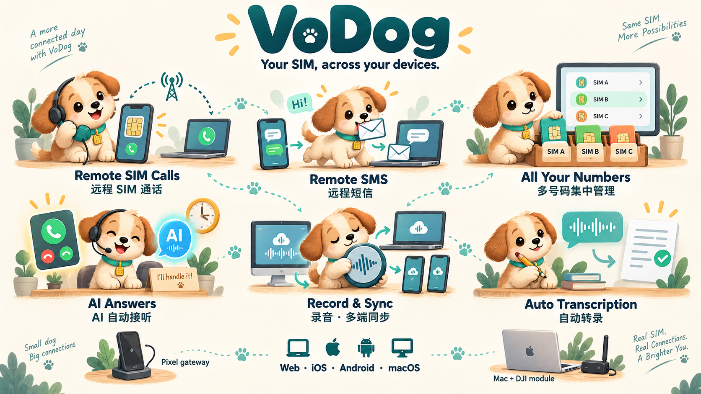
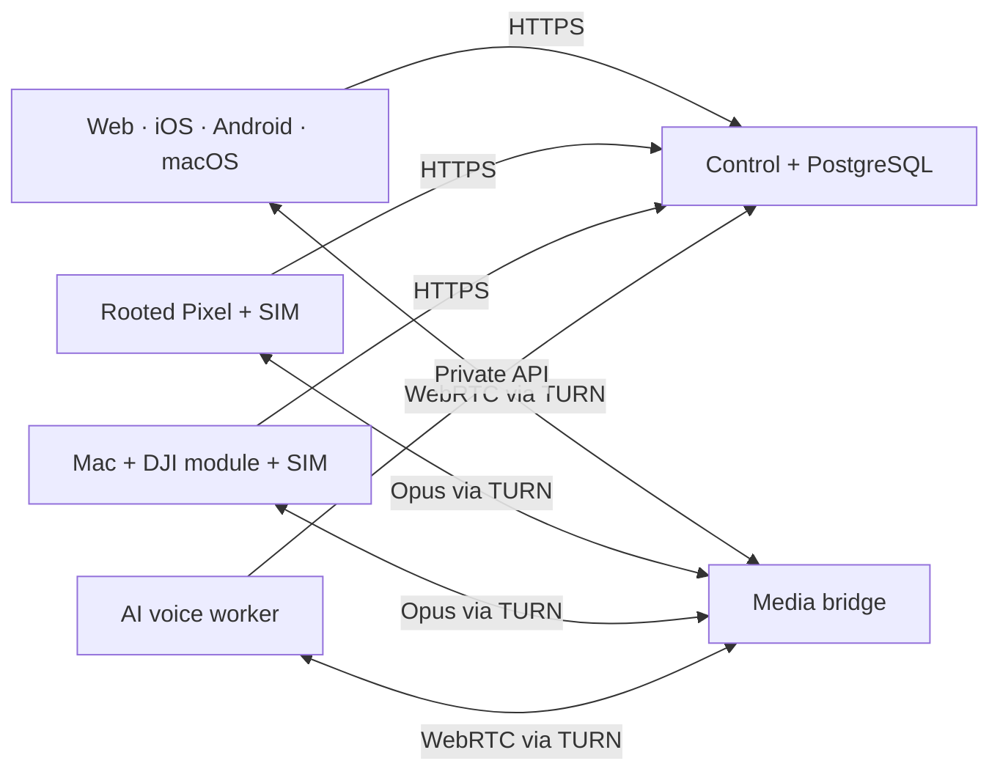

# VoDog

**Your SIM, across your devices.**

VoDog is a self-hosted calling and SMS system. Connect a compatible rooted Pixel or a supported DJI 4G module, then use its real mobile number from Web, iOS, Android, and macOS. Keep call records, recordings, transcripts, and AI answering under your own deployment's control.

[简体中文](README.zh-CN.md) · [Documentation](docs/README.md) · [Installation](docs/installation.md) · [AI installation playbook](readme-for-ai.md)

## What you can do

- **Call remotely:** place and answer cellular calls, reject or end calls, send DTMF, and choose an assigned SIM. Voice travels through authenticated, relay-only WebRTC.
- **Send and receive SMS:** shared conversations, multipart messages, queued sending, and supported gateway-originated message synchronization. SMS support does not imply RCS or MMS support.
- **Use four clients:** a responsive Web app, native iOS and Android clients, and a native macOS client that can also host DJI module gateways. One [Signal UI](docs/design/signal/README.md) across Web, iOS, Android and macOS: shared tokens and states, native controls on each platform.
- **Keep the conversation:** gateway-local capture and server-side recording, resumable original archives, authorized playback, MP3 export, transcripts, and reports where configured.
- **Let AI answer:** human answering, immediate AI answering, or AI after a timeout, with xAI and Doubao adapters. Provider credentials and a working voice worker are required.
- **Manage your numbers:** contacts, separate call/SMS blocklists, interception history, SIM labels, gateway readiness, and account-scoped settings.

These are source capabilities, not a claim that a fresh VoDog installation has passed physical-device acceptance. Availability depends on gateway capabilities, feature gates, carrier behavior, credentials, and platform permissions. See the [support matrix](docs/support.md).

## Two gateway choices

| Gateway | What it needs | Where it runs |
| --- | --- | --- |
| Pixel | An unlockable, rooted Pixel with compatible telephony/audio privileges, an active voice/SMS SIM, and the reviewed gateway package | On the phone; the development computer is not a runtime dependency |
| DJI 4G | **QDC507 / Quectel EG25-G**, compatible firmware, voice/SMS SIM, supported USB identity and audio interface | On a Mac running VoDog's module integration; unplugging the module or stopping the app takes it offline |

The Pixel implementation is based on the Pixel 7 Pro integration. Other Pixels, Android builds, carrier variants, and unrelated LTE dongles are **not automatically supported**. The DJI path is not a general promise of support for every DJI product. Read [hardware requirements](docs/hardware.md) before choosing equipment.

The required DJI runtime binaries and upstream manifest are bundled and packaged by default; compatible hardware/firmware still needs validation. Exact corresponding kernel build sources remain incomplete. See [DJI setup](docs/dji-setup.md).

## How it fits together

Control owns identity, SIM assignment, call arbitration, queues, and records. The media bridge carries audio; coturn provides relay connectivity. The optional AI worker takes a client media role under a short-lived lease. The Mac's local-module calling path can use the module directly and synchronize records and archives afterward. [Architecture and data flow →](docs/architecture.md)

## Get started

1. Read the [support matrix](docs/support.md) and [hardware guide](docs/hardware.md).
2. Prepare your own VPS, domain, TLS certificates, PostgreSQL, media bridge, and TURN service using the [installation guide](docs/installation.md).
3. Build the components with the [development guide](docs/development.md), configure your own identities and secrets, then pair one gateway and assign its SIM.
4. Follow the [acceptance checklist](docs/operations.md) before relying on remote calls, background ringing, recording, or AI.

There is no shared demo account, hosted service, bundled SIM, or pre-provisioned infrastructure. Example domains such as `vodog.example.com` and the node ID `relay-primary` are placeholders. This source release has **not been verified as a fresh installation**; build, deployment, UI, physical-device, and cellular acceptance are separate steps.

## Repository

| Path | Purpose |
| --- | --- |
| `apps/web` | React / Vite Web client |
| `apps/ios` | SwiftUI, CallKit, and PushKit client |
| `apps/android/client` | Kotlin / Compose client |
| `apps/android/gateway` | Pixel cellular gateway |
| `apps/macos` | macOS client and DJI module gateway integration, derived from CellDock |
| `services/control` | Fastify / TypeScript API, PostgreSQL, recording and transcript orchestration |
| `services/media` | Go / Pion media bridge |
| `services/voice` | Node.js realtime AI voice adapters and worker |
| `services/recording-archive-validator` | Go archive validation tool |
| `infra` | Build, configuration, deployment, and diagnostic tooling; review before use |

## Guides

[All documentation](docs/README.md) · [Hardware](docs/hardware.md) · [Install and configure](docs/installation.md) · [Develop and test](docs/development.md) · [Recording and AI](docs/recording-ai.md) · [Operate and verify](docs/operations.md) · [Security and privacy](docs/security.md) · [Licenses and attribution](docs/licensing.md)

These screens use synthetic demo data, not real calls or accounts, and do not establish fresh-install acceptance.

## License

**VoDog is a mixed-license source distribution.** First-party VoDog code is licensed under **AGPL-3.0-only**, subject to the root license and file-level notices. Third-party code keeps its own license. In particular, **CellDock-derived macOS code retains its custom non-commercial license**: it permits copying, modification, and distribution with attribution, and excludes business use. The root AGPL license does not override that restriction.

The macOS component is source-available under noncommercial terms. Its required voice runtime binaries are archived from pinned CellDock upstream; exact corresponding kernel source/build inputs remain unavailable. See [licensing and attribution](docs/licensing.md) for component-specific terms.

[Pixel setup walkthrough](docs/pixel-setup.md) · [DJI setup walkthrough](docs/dji-setup.md) · [Host installer](infra/README.md)

[Release checks and remaining limits](docs/release-checks.md)

## Acknowledgments

Thanks to [CellDock](https://github.com/celldock/celldock-for-mac) authors and contributors for the macOS/DJI integration foundation, including its design acknowledgment of [MaVo / moluncn](https://github.com/moluncn/mavo). Thanks also to chenxiaolong for BCP/BCR and the authors of Magisk, Shizuku, Opus, WebRTC, Pion, and other dependencies. See [CONTRIBUTORS.md](CONTRIBUTORS.md) and [third-party attribution](docs/attribution.md) for authors, sources, and relationships.

[Audio compression and transport: methods and source map](docs/audio-transport.md)
