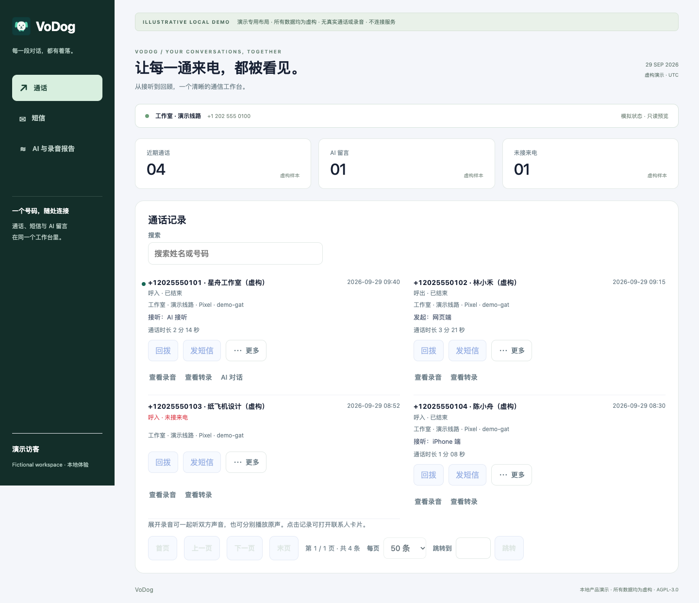
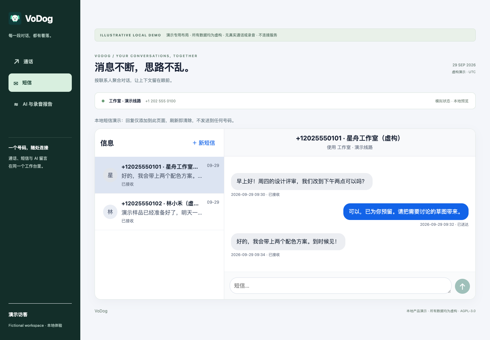
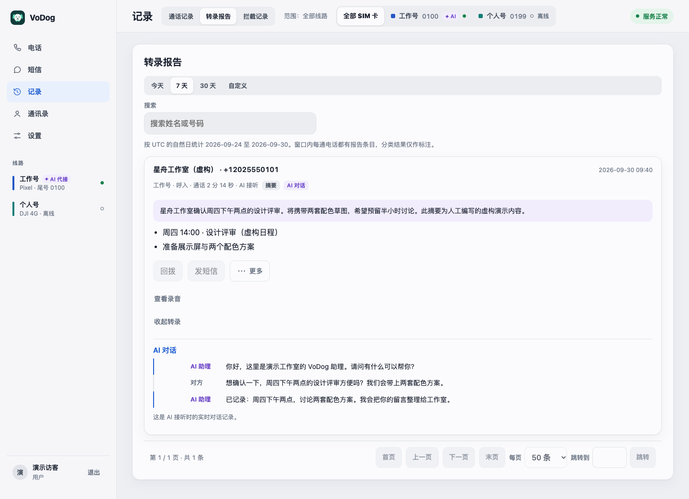

# VoDog

**让你的 SIM 号码，随设备而行。**

VoDog 是可自行部署的通话与短信系统。接入兼容的已 root Pixel 或受支持的 DJI 4G 模组，即可在 Web、iOS、Android 与 macOS 上使用真实手机号码，并在自己的部署环境中管理通话记录、录音、转录和 AI 代接。

[English](README.md) · [文档目录](docs/README.zh-CN.md) · [安装指南](docs/installation.zh-CN.md) · [AI 安装执行手册](readme-for-ai.md)

## 功能

- **远程通话：**选择已分配的 SIM 拨打、接听、拒接、挂断和发送 DTMF；音频通过经过鉴权、仅使用中继的 WebRTC 传输。
- **短信收发：**跨端会话、长短信分段处理、发送队列，以及受支持的网关本机短信同步。支持 SMS 不代表支持 RCS 或 MMS。
- **四端使用：**响应式 Web、原生 iOS 和 Android 客户端，以及同时可承载 DJI 网关的原生 macOS 客户端。
- **保留通话内容：**网关本地采集、服务端录音、原始归档断点续传、授权播放、MP3 导出，以及按配置启用的转录和报告。
- **AI 代接：**人工接听、AI 即接、超时转 AI；提供 xAI 与豆包适配器，需要自备供应商凭据并配置语音 worker。
- **号码管理：**联系人、独立的来电与短信黑名单、拦截记录、SIM 备注、网关就绪状态与账号设置。

以上描述的是源码能力，不代表全新 VoDog 安装已经通过真机验收。实际可用性取决于网关能力、功能门、运营商、凭据和系统权限。详见[支持矩阵](docs/support.zh-CN.md)。

## 两种网关

| 网关 | 前提 | 运行位置 |
| --- | --- | --- |
| Pixel | 可解锁 bootloader、已 root、具有兼容电话与音频特权的 Pixel，支持通话和短信的 SIM，以及经过审核的网关包 | 手机本身；日常运行不依赖开发电脑 |
| DJI 4G | **QDC507 / Quectel EG25-G**、兼容固件、语音/短信 SIM、受支持的 USB 身份和音频接口 | 运行 VoDog 模组集成的 Mac；拔出模组或退出应用即离线 |

Pixel 实现以 Pixel 7 Pro 集成为基础，不能据此认定其他 Pixel、Android 版本、运营商定制机或普通 LTE 网卡全部受支持。DJI 路径也不代表支持所有 DJI 产品。选购前请读[硬件要求](docs/hardware.zh-CN.md)。

DJI 本机/网关语音需要另行取得并验证的兼容运行时；本发行排除了缺少准确对应源码的内核二进制。详见 [DJI 设置](docs/dji-setup.zh-CN.md)。

## 系统结构

Web / iOS / Android / macOS 通过 HTTPS 连接 Control。Pixel 与 Mac 上的 DJI 网关执行真实 SIM 操作；媒体桥配合 coturn 中继音频；可选 AI worker 通过短期租约接听来电。Control 统一管理身份、SIM 归属、通话仲裁、队列与记录。Mac 本机模组直拨可直接使用 USB 音频，结束后同步记录与归档。详见[架构与数据流](docs/architecture.zh-CN.md)。

## 开始使用

1. 阅读[支持矩阵](docs/support.zh-CN.md)和[硬件指南](docs/hardware.zh-CN.md)。
2. 按[安装指南](docs/installation.zh-CN.md)准备自己的 VPS、域名、TLS、PostgreSQL、媒体桥和 TURN。
3. 按[开发指南](docs/development.zh-CN.md)构建组件，配置自己的身份与密钥，再配对一个网关并分配 SIM。
4. 在依赖远程通话、后台来电、录音或 AI 前，完成[验收清单](docs/operations.zh-CN.md)。

本项目不提供共享演示账号、托管服务、SIM 或预配置基础设施。`vodog.example.com` 和节点 ID `relay-primary` 均为占位示例。**全新安装尚未验证**；构建、部署、界面、真机与真实蜂窝验收分别记录。

## 仓库结构

| 路径 | 用途 |
| --- | --- |
| `apps/web` | React / Vite Web 客户端 |
| `apps/ios` | SwiftUI、CallKit、PushKit 客户端 |
| `apps/android/client` | Kotlin / Compose 客户端 |
| `apps/android/gateway` | Pixel 蜂窝网关 |
| `apps/macos` | 基于 CellDock 的 macOS 客户端与 DJI 网关集成 |
| `services/control` | Fastify / TypeScript API、PostgreSQL、录音和转录编排 |
| `services/media` | Go / Pion 媒体桥 |
| `services/voice` | Node.js 实时 AI 适配器和 worker |
| `services/recording-archive-validator` | Go 归档校验工具 |
| `infra` | 构建、配置、部署与诊断工具；使用前需审核 |

## 文档

[全部文档](docs/README.zh-CN.md) · [硬件](docs/hardware.zh-CN.md) · [安装配置](docs/installation.zh-CN.md) · [开发测试](docs/development.zh-CN.md) · [录音与 AI](docs/recording-ai.zh-CN.md) · [运维验收](docs/operations.zh-CN.md) · [安全隐私](docs/security.zh-CN.md) · [许可与署名](docs/licensing.zh-CN.md)

以下界面使用合成演示数据，不是真实电话/账户，也不表示新安装验收通过。

## 许可

**VoDog 是混合许可的源码发行。** 第一方 VoDog 代码采用 **AGPL-3.0-only**，以根目录许可及文件级声明为准。第三方代码保留原许可。尤其是 **CellDock 衍生的 macOS 代码仍受自定义非商业许可约束**：允许在保留署名的前提下复制、修改和分发，不允许商业用途。根目录 AGPL 不能覆盖此限制。

macOS 部分以非商业条款提供源码，其可选语音内核二进制因缺少准确对应源码与构建材料而未包含。各组件的使用与再分发条件见[许可与署名](docs/licensing.zh-CN.md)。

[Pixel 设置教程](docs/pixel-setup.zh-CN.md) · [DJI 设置教程](docs/dji-setup.zh-CN.md) · [主机安装工具](infra/README.md)

[发行检查与剩余限制](docs/release-checks.md)

## 致谢

感谢 [CellDock](https://github.com/celldock/celldock-for-mac) 作者与贡献者提供 macOS/DJI 集成基础，并保留其对 [MaVo / moluncn](https://github.com/moluncn/mavo) 的设计致谢。感谢 chenxiaolong 的 BCP/BCR，以及 Magisk、Shizuku、Opus、WebRTC、Pion 等上游作者。完整名单、来源和使用关系见 [CONTRIBUTORS.md](CONTRIBUTORS.md) 与 [第三方署名](docs/attribution.zh-CN.md)。

[语音压缩与传输：方法及源码位置](docs/audio-transport.zh-CN.md)
